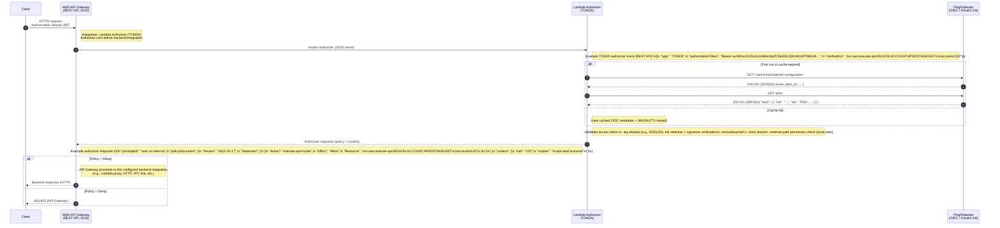

```mermaid
sequenceDiagram
  autonumber
  participant C as Client
  participant AG as AWS API Gateway<br/>(REST API, 2015)
  participant LA as Lambda Authorizer<br/>(TOKEN)
  participant PF as PingFederate<br/>(OIDC / OAuth2 AS)

  C->>AG: HTTPS request<br/>Authorization: Bearer JWT
note right of AG: Integration: Lambda Authorizer (TOKEN)<br/>Authorizer runs before backend integration

AG->>LA: Invoke authorizer (JSON event)
note right of LA: Example TOKEN authorizer event (REST API):\n{\n  "type": "TOKEN",\n  "authorizationToken": "Bearer eyJhbGciOiJSUzUxMiIsImtpZCI6InRlc3QtcnM1MTItMSJ9....",\n  "methodArn": "arn:aws:execute-api:REGION:ACCOUNT:APIID/STAGE/GET/v1/accounts/123"\n}

alt First run or cache expired
LA->>PF: GET /.well-known/openid-configuration
PF-->>LA: 200 OK (JSON)\n{ issuer, jwks_uri, ... }
LA->>PF: GET /jwks
PF-->>LA: 200 OK (JWKS)\n{ "keys": [ { "kid": "...", "kty": "RSA", ... } ] }
else Cache hit
note right of LA: Uses cached OIDC metadata + JWKS\n(TTL-based)
end

note right of LA: Validates access token:\n- alg allowlist (e.g., RS512)\n- kid selection + signature verification\n- iss/aud/exp/nbf (+ clock skew)\n- method+path permission check (local rules)

LA-->>AG: Authorizer response (policy + context)
note right of AG: Example authorizer response:\n{\n  "principalId": "user-or-client-id",\n  "policyDocument": {\n    "Version": "2012-10-17",\n    "Statement": [\n      {\n        "Action": "execute-api:Invoke",\n        "Effect": "Allow",\n        "Resource": "arn:aws:execute-api:REGION:ACCOUNT:APIID/STAGE/GET/v1/accounts/123"\n      }\n    ]\n  },\n  "context": {\n    "sub": "123",\n    "scopes": "scope:read:accounts"\n  }\n}

alt Policy = Allow
note right of AG: API Gateway proceeds to the configured backend integration<br/>(e.g., Lambda proxy, HTTP, VPC link, etc.)
AG-->>C: Backend response (HTTP)
else Policy = Deny
AG-->>C: 401/403 (API Gateway)
end
```
